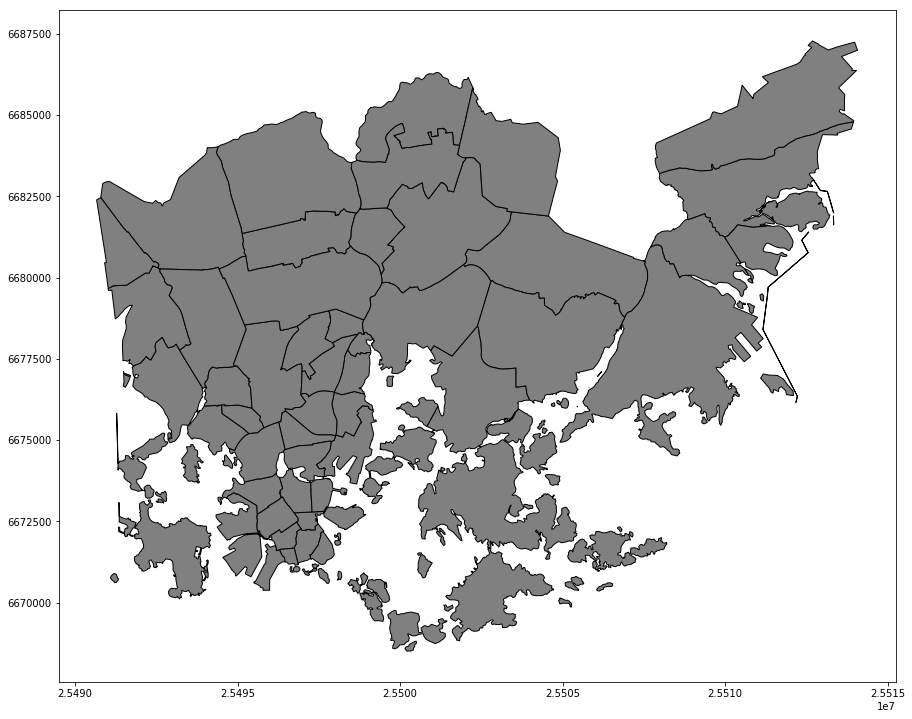

# HKI-GIS

Includes a [shapefile](./helsinki_district_map/) of 59 districts of Helsinki (water areas removed).

| Column   | Description                         |
|:--------:|:-----------------------------------:|
| name_fi  | Finnish name of the district        |
| name_se  | Swedish name of the district        |
| geometry | Polygon of the district coordinates |

